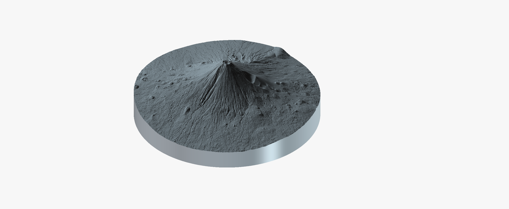
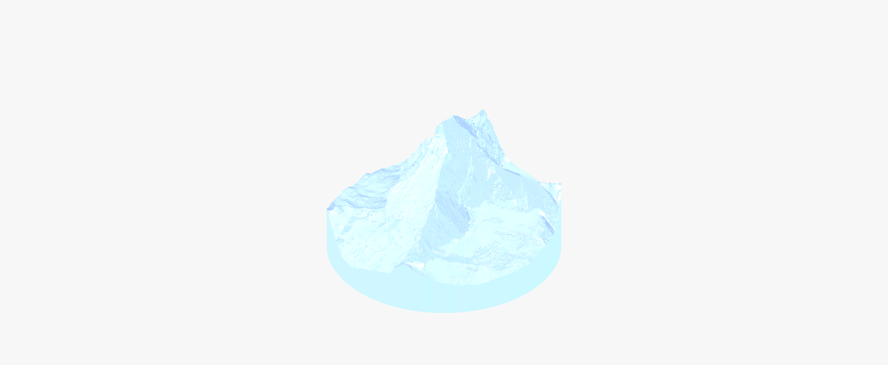

# dem-to-stl

*[English version](README.md)*

Découpe un modèle numérique de terrain (DEM/MNT, GeoTIFF projeté en
mètres) selon un cercle, et exporte un maillage **STL solide et
étanche** (relief + paroi verticale + fond plat), prêt pour
l'impression 3D ou l'usinage CNC — sans trou, sans paroi non-manifold,
échelle physique précise.

## Origine du projet

Ce dépôt est le fruit d'une longue conversation entre un amateur de
travail du bois et de CNC (aucune formation en géomatique ni en
développement logiciel) et Claude (Anthropic), pour produire des
reliefs imprimables à partir de vraies données topographiques du monde
entier — le Mont Fuji, l'Everest, Monument Valley, La Réunion, le
Cervin, entre autres.

**La quasi-totalité du code a été écrite par l'IA sous la direction et
la validation d'un humain** : chaque fonctionnalité est née d'un besoin
concret rencontré en cours de route (un maillage percé, des parois trop
fines pour l'impression, des artefacts de données en pleine mer...),
implémentée par Claude, puis testée sur des données réelles avant
d'être acceptée. Les corrections les moins évidentes (pincement
diagonal, séparation terre/mer par composante connexe plutôt que par
seuil d'altitude) sont documentées ci-dessous et dans les commentaires
du code, précisément parce qu'elles ne sont pas intuitives et qu'on ne
les découvre qu'en pratique.

Aucune garantie de qualité "production" au sens habituel du terme —
c'est un outil de passionné, testé sur des dizaines de cas réels par
un seul utilisateur, pas audité par une communauté. Les retours,
corrections et *pull requests* sont bienvenus.

## Fonctionnalités

- Découpe circulaire d'un DEM autour d'un centre (X, Y) et d'un rayon,
  avec mise à l'échelle physique précise vers un diamètre imprimé cible.
- Maillage garanti étanche (vérifié : chaque arête partagée par
  exactement 2 triangles) et normales cohérentes (volume signé positif).
- Élimination automatique des parois trop fines pour l'impression FDM
  (ouverture morphologique) et des pincements en diagonale
  (sommets non-manifold invisibles à un simple test d'étanchéité).
- **Mode île** (`--sea-level`) : pour un DEM où la donnée en mer est
  absente ou aberrante (cas fréquent des LiDAR topographiques), les
  pixels invalides sont remplacés par un plat au niveau de la mer
  plutôt qu'exclus — le relief réel émerge d'un disque toujours plein.
  Sépare la vraie terre du bruit de surface d'eau (vagues classées par
  erreur comme "sol") par composante connexe **et** seuil d'altitude —
  la connectivité seule ne suffit pas quand ce bruit touche le vrai
  littoral.
- Barres de progression (natives GDAL pour le ré-échantillonnage,
  maison pour les boucles Python pures) — utile sur les gros volumes
  (La Réunion : ~40 Go de tuiles sources).
- Diamètre et épaisseur de socle demandés interactivement si omis en
  ligne de commande.

## Galerie

<table>
<tr>
<td></td>
<td></td>
</tr>
<tr>
<td align="center">Mont Fuji — cratère sommital</td>
<td align="center">Cervin</td>
</tr>
</table>

D'autres angles pour chaque site sont disponibles dans [`screenshots/`](screenshots/).

## Installation

```bash
pip install -r requirements.txt
```

GDAL nécessite les bibliothèques système correspondantes (`libgdal-dev`
sur Debian/Ubuntu, `gdal` sur Arch) — si `pip install gdal` échoue,
installe GDAL via le gestionnaire de paquets de ton système plutôt que
pip seul.

Un tutoriel complet, pas à pas — de la prise en main rapide sans
téléchargement jusqu'au traitement d'un vrai relief — est disponible
dans [TUTORIAL.md](TUTORIAL.md).

## Usage

```bash
python circle_dem_to_stl.py \
    --input mont_fuji_dem1a.tif \
    --output fuji_disc.stl \
    --cx 293526 --cy 3915399 --radius 9300 \
    --diameter-mm 250 --vexag 1.0
```

Ou directement en coordonnées géographiques (WGS84), que la source soit
déjà projetée ou non — si elle est en CRS géographique, une zone UTM
est déterminée et appliquée automatiquement, sans reprojection manuelle
préalable :

```bash
python circle_dem_to_stl.py \
    --input copernicus_glo30.tif \
    --output relief_disc.stl \
    --lat 35.3606 --lon 138.7274 --radius 9300 \
    --diameter-mm 250 --vexag 1.0
```

### Téléchargement Copernicus DEM intégré

Pas de fichier source sous la main ? `--download-copernicus` récupère
automatiquement les tuiles GLO-30 (30 m, par défaut) ou GLO-90 (90 m)
nécessaires depuis le compartiment S3 public de Copernicus DEM (accès
direct, sans compte ni clé API) :

```bash
python circle_dem_to_stl.py \
    --download-copernicus --cache-dir ./cache \
    --lat 35.3606 --lon 138.7274 --radius 9300 \
    --output relief_disc.stl --diameter-mm 250 --vexag 1.0
```

Les tuiles sont mises en cache dans `--cache-dir` (une par degré carré,
réutilisées d'un lancement à l'autre) et assemblées automatiquement en
mosaïque. Requiert `--lat`/`--lon` (pas `--cx`/`--cy`, puisqu'il faut
des coordonnées géographiques pour déterminer les tuiles). Les tuiles
purement océaniques (absentes du compartiment par convention) sont
ignorées sans faire échouer le téléchargement.

Sans `--diameter-mm`, `--base-mm` ni `--vexag`, le script les demande de
façon interactive au lancement.

### Mode île (relief entouré d'eau sans donnée fiable)

```bash
python circle_dem_to_stl.py \
    --input reunion_mosaic.vrt \
    --output reunion_disc.stl \
    --cx 347000 --cy 7664000 --radius 38000 \
    --diameter-mm 250 --vexag 3.0 \
    --sea-level 0
```

### Toutes les options

| Option | Description | Défaut |
|---|---|---|
| `--input` | GeoTIFF ou VRT source, CRS géographique ou projeté | requis |
| `--output` | Fichier STL de sortie | requis |
| `--cx`, `--cy` | Centre du cercle, dans le CRS du fichier source | voir `--lat`/`--lon` |
| `--lat`, `--lon` | Centre du cercle en WGS84 — alternative à `--cx`/`--cy` | voir `--cx`/`--cy` |
| `--radius` | Rayon du cercle, en mètres | requis |
| `--diameter-mm` | Diamètre final imprimé, en mm | demandé si omis (250) |
| `--base-mm` | Épaisseur du socle plat, en mm | demandé si omis (3) |
| `--vexag` | Exagération verticale | demandée si omise (1.0) |
| `--print-spacing-mm` | Résolution cible du maillage, en mm | 0.2 |
| `--sea-level` | Active le mode île à cette altitude (m) | désactivé |
| `--min-elevation` | Seuil d'exclusion des gouffres d'interpolation, en m | -50 |
| `--land-threshold` | Seuil terre/bruit d'eau au-dessus de `--sea-level`, en m | 1.0 |
| `--download-copernicus` | Télécharge les tuiles Copernicus DEM nécessaires au lieu de fournir `--input` | désactivé |
| `--copernicus-product` | Résolution Copernicus à télécharger : `30` (GLO-30) ou `90` (GLO-90) | 30 |
| `--cache-dir` | Dossier de cache des tuiles Copernicus téléchargées | `./copernicus_cache` |

Fournis soit `--cx`/`--cy`, soit `--lat`/`--lon` — pas les deux.

## Architecture

```
circle_dem_to_stl.py   # argparse, prompts interactifs, orchestration
raster.py              # GDAL : ouverture, détection/reprojection CRS, ré-échantillonnage
mesh.py                # numpy/scipy pur : nettoyage du masque, construction du maillage
stl_io.py              # écriture STL binaire
download.py            # téléchargement Copernicus DEM (compartiment S3 public)
tests/
```

`mesh.py` ne dépend jamais de GDAL ni du disque — testable avec de
simples tableaux numpy, ce qui permet de vérifier étanchéité et
cohérence des normales sans jamais ouvrir un fichier.

## Sources de données compatibles

Testé avec succès sur, entre autres : GSI DEM1A (Japon, XML/JPGIS —
nécessite un pré-traitement, non inclus ici), IGN LiDAR HD (France),
USGS 3DEP (États-Unis), swissALTI3D (Suisse), Kartverket LiDAR
(Norvège), Copernicus GLO-30 (mondial). Le CRS géographique ou projeté
est détecté automatiquement (`gdalinfo` reste utile pour vérifier ce
que contient un fichier avant de s'en servir, mais la reprojection
manuelle préalable n'est plus nécessaire).

## Sources nationales automatiques (`--source`)

Avec `--lat/--lon`, le DEM peut être récupéré automatiquement au lieu de
fournir `--input` :

```
python circle_dem_to_stl.py --source auto --lat 46.0 --lon 7.6 --radius 5000 --output out.stl
```

| `--source` | Fournisseur | Méthode d'accès |
|---|---|---|
| `swisstopo` | swissALTI3D (Suisse) | API STAC, tuiles GeoTIFF 0,5 m / 2 m |
| `kartverket` | Høydedata DTM1 (Norvège) | WCS, ré-échantillonné à la résolution de travail |
| `usgs` | 3DEP (États-Unis) | API TNM Access, lecture partielle via `/vsicurl/` |
| `gsi` | Tuiles d'élévation GSI (Japon) | tuiles PNG (DEM1A → DEM5A/5B → DEM10B), Web Mercator |
| `ign` | MNT LiDAR HD 0,5 m, repli RGE ALTI 1 m (France, La Réunion) | WMS-R, GeoTIFF flottant brut ; les images rendues/estompées sont rejetées |
| `copernicus` | GLO-30/90 (monde) | identique à `--download-copernicus` |
| `auto` | source nationale couvrant le point, sinon Copernicus | — |

La résolution récupérée suit la résolution de travail (déduite de
`--diameter-mm`, `--radius` et `--print-spacing-mm`) : pas de 1 m
téléchargé quand une grille de 15 m suffit. Les données sont mises en
cache dans `--cache-dir`.

**État.** Ces fournisseurs ont été écrits d'après la documentation
officielle mais n'ont pas pu être testés sur les serveurs réels dans
l'environnement de développement (les tests utilisent du HTTP simulé).
Les noms de jeux de données USGS et le nom de couverture Kartverket en
particulier sont à confirmer au premier usage réel. Kartverket et IGN (serveurs WCS/WMS dont la syntaxe exacte n'a pas pu être confirmée) essaient plusieurs variantes de requête et journalisent celle acceptée ; la couverture LiDAR HD de la France est encore incomplète (un avertissement indique la part du disque sans donnée). Le téléchargement XML FGD de
GSI exige un compte et n'est pas automatisé ; le service de tuiles est
utilisé à la place (valeurs interpolées, pas le maillage JPGIS brut).

### Noms de lieux (`--place`)

À la place des coordonnées, tu peux donner un nom de lieu ; il est résolu avec
Nominatim (OpenStreetMap) et, sans `--input` ni `--source`, la source de DEM est
choisie automatiquement :

```
python circle_dem_to_stl.py --place "Mont Fuji" --radius 9300 --diameter-mm 250 --output fuji.stl
```

Le premier résultat (ordre de pertinence de Nominatim) est utilisé ; les autres
candidats sont listés dans le log et `--place-pick N` en choisit un autre. Une
zone administrative ou une île se résout à son centre, pas à un sommet : le log
l'indique, et `--lat/--lon` reste disponible pour un point exact. Le serveur
public Nominatim limite à 1 requête par seconde et attend un User-Agent
identifiant (surcharge avec `DEM2STL_USER_AGENT`, idéalement avec un contact) ;
les résultats sont mis en cache dans `--cache-dir`. Données de géocodage
© contributeurs OpenStreetMap (ODbL).

### Résolution et qualité des sources automatiques

Le maillage est limité par `--print-spacing-mm` : le DEM est ré-échantillonné
(`average`) à `print-spacing / échelle` mètres par pixel (affiché comme « résolution
de ré-échantillonnage » dans le log, par ex. 8 m pour une impression de 150 mm d'un
rayon de 3 km). Les sources ne récupèrent donc que la résolution utile à cette grille
(swisstopo 2 m au lieu de 0,5 m, tuiles GSI au zoom correspondant, requêtes WCS/WMS à
2x la résolution de travail), d'où des fichiers en cache bien plus légers que des
téléchargements en pleine résolution. Moyenner du 0,5 m ou du 2 m jusqu'à 8 m donne
une grille quasi identique.

* `--full-res` récupère la résolution la plus fine de chaque source (téléchargements
  lourds, maillage de même taille). Sans lui, Kartverket et IGN ré-échantillonnent côté
  serveur (plus proche voisin) à 2x la résolution de travail avant de moyenner ;
  `--full-res` supprime ce raccourci.
* Les tuiles d'élévation GSI sont dérivées du DEM (interpolées, pas de 1 cm), pas le
  maillage JPGIS brut ; leur nombre est plafonné, donc une très grande zone utilise un
  zoom plus grossier.
* `compare_dems.py A B --lat .. --lon .. --radius .. --pixel-size ..` mesure l'écart
  entre deux DEM sur la grille de travail (décalage moyen, RMS, 95e centile), pour
  valider une source automatique contre des données téléchargées à la main.

### Combler les trous avec Copernicus (`--fill-with-copernicus`)

Les sources nationales s'arrêtent à leur frontière (par ex. swissALTI3D côté
italien du Cervin) et certaines sont incomplètes (IGN LiDAR HD). Avec
`--fill-with-copernicus` (requiert `--lat/--lon` ou `--place` ; fonctionne avec
`--source` ou `--input`), les parties du disque sans donnée sont comblées avec
Copernicus GLO-30, téléchargé seulement s'il y a des trous. Copernicus est d'abord
décalé en altitude de la différence médiane mesurée sur la zone couverte par les
deux rasters (journalisée, avec l'écart interquartile) ; le comblement est abandonné
si ce décalage dépasse 50 m. Limites : Copernicus est un modèle de surface (arbres,
bâtiments) à 30 m alors que les données nationales sont en général du sol nu, donc
le raccord montre un changement de résolution et de nature ; le log indique la part
du disque comblée.

### Découpe par polygone (`--polygon`)

À la place d'un disque, ne modéliser que l'intérieur d'un contour (île, frontière,
commune...). Le contour peut être tout fichier vectoriel lisible par OGR (GeoJSON,
GPKG, shapefile), dans n'importe quel CRS :

```
python circle_dem_to_stl.py --polygon corse.geojson --polygon-where "NAME='Corse'" \
    --diameter-mm 200 --vexag 2 --base-mm 3 --output corse.stl
```

* Le centre et la taille viennent du contour : `--radius`, `--lat/--lon`, `--cx/--cy`,
  `--place` et `--smooth-wall` sont refusés avec `--polygon`. Sans `--input` ni
  `--source`, la source de DEM est choisie automatiquement (`--source auto`).
* `--diameter-mm` est la **plus grande dimension imprimée** du contour.
* Tous les polygones du fichier (ou ceux choisis par `--polygon-where`, un filtre
  d'attributs OGR) sont fusionnés ; trous et parties disjointes (archipel) sont gardés.
* La paroi suit le contour en escalier à la résolution de travail. Une pointe plus fine
  qu'un pas de grille est absente du maillage : la dimension imprimée peut être de
  quelques pas plus courte que demandée pour des formes très pointues.
* `--fill-with-copernicus` et `--sea-level` fonctionnent avec un contour ; les polygones
  qui traversent l'antiméridien ne sont pas gérés.

### Contrôler un STL (`check_stl.py`)

```
python check_stl.py cervin.stl --diameter-mm 150 --base-mm 3 --radius 3000 --relief-m 2247
```

Relit le STL binaire (indépendamment du code de maillage) et vérifie la plus grande
dimension horizontale, l'épaisseur du socle, le dénivelé impliqué par l'échelle (avec
`--radius`, éventuellement comparé à `--relief-m`, tolérance 1 %) et l'étanchéité
(arêtes ouvertes, non-manifold ou mal orientées). Code de sortie 1 en cas d'échec ;
`--tol-mm` règle la tolérance sur les dimensions, `--no-watertight` saute le test des
arêtes sur de très gros fichiers.

### Contours de lieux (`--place ... --clip-to-place`)

`--clip-to-place` découpe selon le contour OpenStreetMap du lieu (île, commune, pays)
au lieu d'un cercle ; le contour est demandé à Nominatim (`polygon_geojson`, simplifié
côté serveur à environ 30 m) puis se comporte exactement comme `--polygon`. Un résultat
purement ponctuel (un sommet, par exemple) n'a pas de contour : l'outil l'indique, et
`--place-pick` permet de choisir un autre candidat.

```
python circle_dem_to_stl.py --place "La Réunion" --clip-to-place --diameter-mm 200 --output reunion.stl
```

## Sources de données, licences et mentions

L'outil ne fait que télécharger les données ; les conditions ci-dessous comptent quand
tu **partages ou vends** un modèle construit à partir d'elles. Formulations relevées sur
les pages de chaque fournisseur en octobre 2026 ; ce n'est pas un avis juridique,
vérifie les conditions en vigueur avant de publier.

| Source | Conditions | Mention |
|---|---|---|
| swisstopo (swissALTI3D) | Open Government Data : usage libre, y compris commercial | Obligatoire : « © swisstopo » ou « Office fédéral de topographie swisstopo » |
| IGN (LiDAR HD, RGE ALTI) | Licence Ouverte Etalab 2.0 (données ouvertes) | Source « IGN » ; RGE ALTI est moins précis sur les fortes pentes (environ 7 m en vertical, d'après le catalogue Earth Engine) |
| Kartverket (Høydedata DTM1) | CC BY 4.0 | Créditer Kartverket |
| USGS 3DEP | Domaine public | Mention demandée (« U.S. Geological Survey, 3D Elevation Program ») |
| GSI Japon (tuiles d'élévation) | Conditions d'utilisation des contenus de la GSI (PDL 1.0) | Indiquer la source (出典:国土地理院ウェブサイト) **et** la transformation des données, par ex. « 地理院タイル (標高タイル(基盤地図情報数値標高モデル))を加工して作成 » ; ne jamais présenter le résultat comme produit par la GSI |
| Copernicus DEM GLO-30 | Licence gratuite | « produced using Copernicus WorldDEM-30 © DLR e.V. 2010-2014 and © Airbus Defence and Space GmbH 2014-2018 provided under COPERNICUS by the European Union and ESA; all rights reserved » en cas de modification ; la licence demande aussi une mention d'exclusion de responsabilité à la diffusion |
| OpenStreetMap / Nominatim (`--place`) | ODbL ; serveur public limité à 1 requête/seconde avec un User-Agent identifiant | « © OpenStreetMap contributors » |

### Garde-fous et vitesse

* Les paramètres sont validés avant tout téléchargement ou calcul : `--radius`,
  `--diameter-mm`, `--base-mm` et `--print-spacing-mm` doivent être strictement positifs,
  `--vexag` ne doit pas être négatif (0 avertit seulement : disque plat), latitude et longitude
  doivent être dans leurs limites. Un raster d'entrée absent ou illisible, une source de
  données inaccessible ou une sortie non écrivable donnent une ligne `Erreur : ...` au lieu
  d'un traceback (`--debug` affiche la trace complète).
* Le dossier de sortie est créé si besoin et vérifié en premier ; le STL est écrit sous un
  nom temporaire puis renommé à la fin : un échec ne laisse jamais de fichier tronqué.
* Avant le calcul, l'outil affiche une estimation (grille, triangles, taille du STL, RAM).
  Si la RAM estimée dépasse 80 % de la RAM disponible (Linux), il s'arrête ; `--force`
  passe outre. Les constantes viennent d'un cas mesuré (4,9 M de triangles : environ 1,05 Go
  de pic) ; au-delà, l'estimation est une extrapolation.
* L'écriture du STL est vectorisée : un modèle de 4,9 M de triangles prend environ 19 s de
  bout en bout sur la machine de développement, contre plusieurs minutes avant. Les sommets
  sont identiques à l'ancien écrivain ; les normales sont égales à l'arrondi float32 près.

### Dossier de sortie et formats (STL, 3MF, OBJ)

Les fichiers générés vont dans `output/` (créé au besoin ; modifiable avec `--output-dir`).
`--output nom.stl` (sans dossier) y est placé ; un chemin avec dossier est respecté tel quel.
`--output` est facultatif : le nom est alors déduit du lieu ou du contour et du diamètre
(`mont-fuji_250mm.stl`) et ne remplace jamais un fichier existant (`_2`, `_3`...).

`--format stl|3mf|obj`, une liste séparée par des virgules, ou `all` écrit plusieurs
formats à partir du même maillage ; l'extension de `--output` choisit le format quand
`--format` est absent. Un nom à extension inconnue reste écrit en STL, sous exactement ce nom.

| Format | Rôle | Contenu |
|---|---|---|
| STL | compatibilité et fabrication | triangles et normales ; sans unité (millimètres par convention) |
| 3MF | impression 3D | maillage indexé, **unité déclarée (millimètre)**, métadonnées (titre, description, mention de la source des données, date, application), environ 4 fois plus compact |
| OBJ | échange et visualisation | sommets et faces seulement, millimètres indiqués en commentaire ; ni normales ni `.mtl` (un relief de DEM n'a pas de matériau à conserver) |

Les trois contiennent les mêmes triangles, dans le même ordre, avec la même orientation
(normales sortantes) et les mêmes coordonnées float32 : `check_stl.py` lit n'importe lequel,
et la suite de tests les compare. Le 3MF est un vrai paquet 3MF écrit avec la bibliothèque
standard (ZIP/OPC, spécification Core) ; `lib3mf`, la bibliothèque officielle, sert aux tests,
si elle est installée, de validateur indépendant. Non vérifié ici : l'ouverture dans
PrusaSlicer lui-même. Mesuré sur 4,9 M de triangles : STL 245 Mo, 3MF 61 Mo, OBJ 192 Mo,
environ 40 s pour les trois. Blender et certains visionneurs importent l'OBJ avec Y vers le
haut : fais pivoter si besoin (le fichier est Z vers le haut).

## Tests

```bash
pytest tests/
```

Les tests reproduisent les scénarios synthétiques utilisés pendant le
développement (île conique, artefact isolé, bruit de surface d'eau
raccordé au littoral, motif en damier) et vérifient l'étanchéité, la
cohérence des normales, et le comportement attendu de chaque option.

## Historique des changements notables

- **Restructuration modulaire** (`raster.py`/`mesh.py`/`stl_io.py`) : élimine la duplication qui existait entre l'ancien `circle_dem_to_stl.py` monolithique et `island_dem_to_stl.py`.
- **Reprojection CRS automatique** : plus besoin de `gdalwarp` manuel avant chaque nouveau site quand la source est en coordonnées géographiques.
- **`--lat`/`--lon`** en alternative à `--cx`/`--cy`.
- **`island_dem_to_stl.py` retiré** : son cas d'usage (relief entouré d'eau) est couvert par `--sea-level`, dont l'approche (cercle à mer plate) s'est révélée préférable en pratique à la silhouette exacte du littoral.

## Licence

GNU GPLv3 — voir [LICENSE](LICENSE). Toute version modifiée ou dérivée
doit rester open source sous la même licence.
